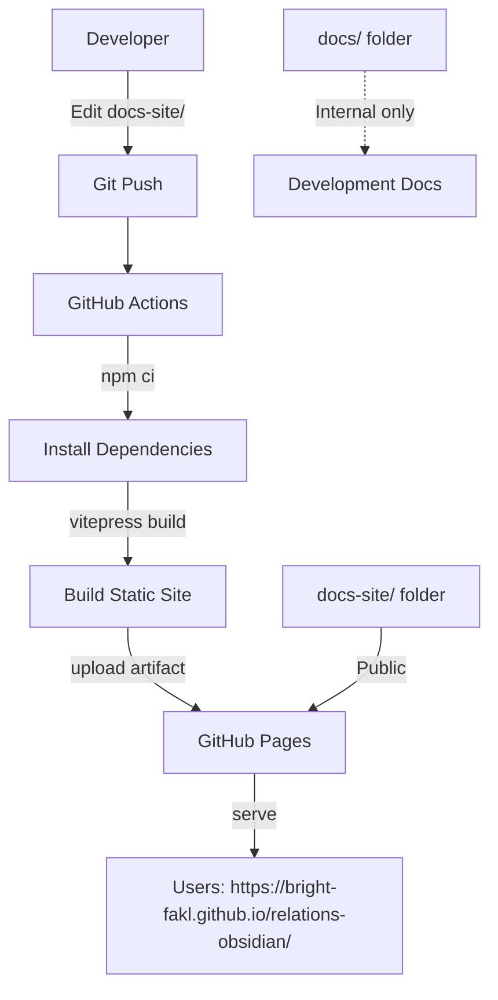

# GitHub Pages Documentation Setup Plan for Relation Explorer Plugin

**Date:** 2025-11-18  
**Plugin:** Relation Explorer (relations-obsidian)  
**Author:** Fabian Kloosterman

---

## Table of Contents

1. [Executive Summary](#executive-summary)
2. [Recommended Solution: VitePress](#recommended-solution-vitepress)
3. [Documentation Structure Plan](#documentation-structure-plan)
4. [Tools and Dependencies](#tools-and-dependencies-needed)
5. [Setup Process](#setup-process)
6. [GitHub Repository Settings](#github-repository-settings)
7. [Content Migration Plan](#content-migration-plan)
8. [Support & Sponsorship Integration](#support--sponsorship-integration)
9. [Development Workflow](#development-workflow)
10. [Maintenance Guidelines](#maintenance-guidelines)
11. [Cost and Performance](#cost-and-performance)
12. [Architecture Diagram](#architecture-diagram)
13. [Summary](#summary)

---

## Executive Summary

This plan outlines the setup of **GitHub Pages documentation** for the Relation Explorer Obsidian plugin using **VitePress** as the static site generator. VitePress perfectly aligns with the existing Node.js/TypeScript toolchain, requires minimal additional dependencies, and provides a modern, fast documentation experience.

**Key Points:**
- ✅ Use VitePress (Vite-powered, matches existing stack)
- ✅ Separate `docs-site/` for published docs, keep `docs/` for internal development
- ✅ Automated deployment via GitHub Actions
- ✅ Zero cost (GitHub Pages is free for public repos)
- ✅ Include sponsor/support links in README and website

---

## Recommended Solution: VitePress

### Why VitePress?

**Perfect Alignment with Your Stack:**
- ✅ Node.js/npm ecosystem (already in use)
- ✅ Vite-powered (matches your Vitest setup)
- ✅ TypeScript support (native to your project)
- ✅ Markdown-native (all docs already in .md format)
- ✅ Zero additional runtime dependencies (Ruby, Python, etc.)

**Key Benefits:**
1. **Fast builds** - Vite's hot module replacement for docs development
2. **Minimal setup** - Simple configuration, works out of the box
3. **Built-in features** - Search, dark mode, mobile-responsive
4. **Automated deployment** - GitHub Actions workflow for CI/CD
5. **Extensible** - Can add custom Vue components if needed later

### Alternative Comparison

| Tool | Pros | Cons | Recommendation |
|------|------|------|----------------|
| **VitePress** | Node.js-based, Vite integration, fast, markdown-native | Slightly more config than Jekyll | ⭐ **Best fit** |
| **Jekyll** | GitHub native, zero build config | Ruby dependency, slower builds | Good fallback |
| **MkDocs** | Excellent for docs, Material theme | Python dependency | Not aligned with stack |
| **Docusaurus** | Feature-rich, React-based | Heavier, more complex | Overkill for this project |

---

## Documentation Structure Plan

### Proposed Layout

```
relations-obsidian/
├── docs/                          # Internal/development documentation (unchanged)
│   ├── milestone-*.md             # Implementation specs
│   ├── implementation-plan.md     # Development roadmap
│   ├── vision.md                  # Project vision
│   └── github-pages-setup-plan.md # This document
│
├── docs-site/                     # Published documentation (NEW)
│   ├── .vitepress/
│   │   ├── config.ts              # VitePress configuration
│   │   └── theme/                 # Custom theme (optional)
│   │
│   ├── index.md                   # Homepage (hero layout)
│   ├── getting-started.md         # Installation & quick start
│   ├── guide/
│   │   ├── configuration.md       # Configuration guide
│   │   ├── usage.md               # Basic usage
│   │   ├── sidebar.md             # Sidebar features
│   │   ├── codeblocks.md          # Embedding trees
│   │   ├── navigation.md          # Navigation commands
│   │   └── context-menu.md        # Context menu guide
│   ├── reference/
│   │   └── api.md                 # API reference
│   ├── support.md                 # Support & Sponsorship page
│   └── public/                    # Static assets (images, logos)
│
└── .github/workflows/
    ├── release.yml                # Existing release workflow
    └── deploy-docs.yml            # New: Deploy documentation (NEW)
```

### Content Organization

**User-Facing Documentation (docs-site/):**
- Homepage with quick overview and hero section
- Getting Started guide with installation instructions
- Feature guides organized by topic
- API reference for plugin developers
- Configuration examples and presets
- Support & Sponsorship information

**Internal Documentation (docs/):**
- Milestone specifications
- Implementation plans
- Development notes
- Vision documents
- This setup plan

---

## Tools and Dependencies Needed

### NPM Packages (Dev Dependencies)

Add to `package.json`:

```json
{
  "devDependencies": {
    "vitepress": "^1.0.0"
  },
  "scripts": {
    "docs:dev": "vitepress dev docs-site",
    "docs:build": "vitepress build docs-site",
    "docs:preview": "vitepress preview docs-site"
  }
}
```

**That's it!** No Python, Ruby, or other language runtimes needed.

---

## Setup Process

### Step 1: Install VitePress

```bash
npm install -D vitepress
```

### Step 2: Create Documentation Structure

```bash
mkdir -p docs-site/.vitepress
mkdir -p docs-site/guide
mkdir -p docs-site/reference
mkdir -p docs-site/public
```

### Step 3: Create VitePress Configuration

**File:** `docs-site/.vitepress/config.ts`

```typescript
import { defineConfig } from 'vitepress'

export default defineConfig({
  title: 'Relation Explorer',
  description: 'Obsidian plugin for visualizing parent-child note relationships',
  base: '/relations-obsidian/',
  
  themeConfig: {
    nav: [
      { text: 'Home', link: '/' },
      { text: 'Guide', link: '/guide/getting-started' },
      { text: 'API Reference', link: '/reference/api' },
      { text: '❤️ Sponsor', link: '/support' },
      { text: 'GitHub', link: 'https://github.com/bright-fakl/relations-obsidian' }
    ],
    
    sidebar: [
      {
        text: 'Introduction',
        items: [
          { text: 'Getting Started', link: '/getting-started' },
          { text: 'Features', link: '/features' }
        ]
      },
      {
        text: 'User Guide',
        items: [
          { text: 'Configuration', link: '/guide/configuration' },
          { text: 'Using the Sidebar', link: '/guide/sidebar' },
          { text: 'Embedding Trees', link: '/guide/codeblocks' },
          { text: 'Navigation Commands', link: '/guide/navigation' },
          { text: 'Context Menu', link: '/guide/context-menu' }
        ]
      },
      {
        text: 'Reference',
        items: [
          { text: 'API Reference', link: '/reference/api' }
        ]
      },
      {
        text: 'Support',
        items: [
          { text: '❤️ Support This Project', link: '/support' }
        ]
      }
    ],
    
    socialLinks: [
      { icon: 'github', link: 'https://github.com/bright-fakl/relations-obsidian' }
    ],
    
    footer: {
      message: 'Released under the MIT License.',
      copyright: 'Copyright © 2024-present Fabian Kloosterman'
    },
    
    search: {
      provider: 'local'
    }
  }
})
```

### Step 4: Create Homepage

**File:** `docs-site/index.md`

```markdown
---
layout: home

hero:
  name: Relation Explorer
  text: Obsidian Plugin
  tagline: Visualize parent-child relationships between notes with powerful navigation and embedded trees
  actions:
    - theme: brand
      text: Get Started
      link: /getting-started
    - theme: alt
      text: View on GitHub
      link: https://github.com/bright-fakl/relations-obsidian
    - theme: alt
      text: ❤️ Sponsor
      link: /support

features:
  - icon: 🌳
    title: Interactive Sidebar
    details: View ancestors, descendants, and siblings for the current note with customizable sections
  - icon: 📝
    title: Embedded Trees
    details: Embed relationship trees directly in notes using relation-tree codeblocks
  - icon: ⚡
    title: Quick Navigation
    details: Navigate instantly to parents, children, or related notes via command palette
  - icon: 🎯
    title: Multiple Hierarchies
    details: Track different types of relationships simultaneously with multiple parent fields
  - icon: 🎨
    title: Per-Field Configuration
    details: Customize display names, visibility, depth, and sorting for each parent field
  - icon: 🔍
    title: Advanced Filtering
    details: Filter trees by tags, folders, or exclude specific notes
---

## Quick Example

Track parent-child relationships using frontmatter:

\`\`\`yaml
---
parent: "[[Parent Note]]"
---
\`\`\`

View the relationship tree in the sidebar, embed it in notes, or navigate quickly using keyboard shortcuts.

---

## Support This Project

If you find Relation Explorer useful, consider supporting its development:

<div style="display: flex; gap: 1rem; align-items: center; margin-top: 1rem;">
  <a href="https://github.com/sponsors/bright-fakl" target="_blank">
    
  </a>
  <a href="https://ko-fi.com/fabiankloosterman" target="_blank">
    
  </a>
</div>
```

### Step 5: Create Support Page

**File:** `docs-site/support.md`

```markdown
---
title: Support This Project
---

# ❤️ Support This Project

Relation Explorer is **free and open source**. If you find it useful, please consider supporting its development!

Your support helps:
- 🐛 **Bug fixes** - Faster resolution of issues
- ✨ **New features** - More powerful relationship navigation
- 📚 **Better documentation** - Clearer guides and examples
- 🚀 **Active maintenance** - Regular updates and improvements

## Ways to Support

### GitHub Sponsors

Support ongoing development through GitHub Sponsors:

<a href="https://github.com/sponsors/bright-fakl" target="_blank">
  
</a>

[❤️ Become a Sponsor on GitHub](https://github.com/sponsors/bright-fakl)

### Ko-fi (One-Time Donation)

Buy me a coffee to show appreciation:

<a href="https://ko-fi.com/fabiankloosterman" target="_blank">
  
</a>

[☕ Buy me a coffee on Ko-fi](https://ko-fi.com/fabiankloosterman)

---

## Other Ways to Help

Even if you can't contribute financially, you can still help:

- ⭐ **Star the repository** on [GitHub](https://github.com/bright-fakl/relations-obsidian)
- 🐛 **Report bugs** or suggest features via [GitHub Issues](https://github.com/bright-fakl/relations-obsidian/issues)
- 📝 **Improve documentation** by submitting pull requests
- 💬 **Share the plugin** with others who might find it useful
- 📣 **Write a review** or create a tutorial

---

## Thank You!

Thank you for using Relation Explorer and for your support! Every contribution, big or small, makes a difference. ❤️

— [Fabian Kloosterman](https://github.com/bright-fakl)
```

### Step 6: Create GitHub Actions Workflow

**File:** `.github/workflows/deploy-docs.yml`

```yaml
name: Deploy Documentation

on:
  push:
    branches:
      - main
    paths:
      - 'docs-site/**'
      - '.github/workflows/deploy-docs.yml'
  workflow_dispatch:

permissions:
  contents: read
  pages: write
  id-token: write

concurrency:
  group: pages
  cancel-in-progress: false

jobs:
  build:
    runs-on: ubuntu-latest
    steps:
      - name: Checkout
        uses: actions/checkout@v4
        with:
          fetch-depth: 0
      
      - name: Setup Node.js
        uses: actions/setup-node@v4
        with:
          node-version: 18
          cache: npm
      
      - name: Install dependencies
        run: npm ci
      
      - name: Build documentation
        run: npm run docs:build
      
      - name: Setup Pages
        uses: actions/configure-pages@v4
      
      - name: Upload artifact
        uses: actions/upload-pages-artifact@v3
        with:
          path: docs-site/.vitepress/dist
  
  deploy:
    environment:
      name: github-pages
      url: ${{ steps.deployment.outputs.page_url }}
    needs: build
    runs-on: ubuntu-latest
    steps:
      - name: Deploy to GitHub Pages
        id: deployment
        uses: actions/deploy-pages@v4
```

### Step 7: Update `.gitignore`

Add to `.gitignore`:

```gitignore
# VitePress
docs-site/.vitepress/dist
docs-site/.vitepress/cache
```

---

## GitHub Repository Settings

### Manual Steps Required

1. **Enable GitHub Pages**
   - Go to your repository on GitHub
   - Navigate to **Settings** → **Pages**
   - Under "Build and deployment":
     - Source: **GitHub Actions** (not "Deploy from a branch")
   - Save changes

2. **Verify Workflow Permissions**
   - Go to **Settings** → **Actions** → **General**
   - Under "Workflow permissions":
     - Ensure "Read and write permissions" is selected
   - Save if changed

3. **First Deployment**
   - Push your changes to the `main` branch
   - Go to **Actions** tab
   - Watch the "Deploy Documentation" workflow run
   - Once complete, your docs will be at: `https://bright-fakl.github.io/relations-obsidian/`

---

## Content Migration Plan

### Files to Copy/Adapt from `docs/` to `docs-site/`

1. **README.md** → `docs-site/index.md` (homepage hero)
2. **README.md** (Installation section) → `docs-site/getting-started.md`
3. **docs/configuration-guide.md** → `docs-site/guide/configuration.md`
4. **docs/ADVANCED-CONTEXT-MENU-GUIDE.md** → `docs-site/guide/context-menu.md`
5. **docs/api-reference.md** → `docs-site/reference/api.md`

### New Content to Create

1. `docs-site/guide/sidebar.md` - Sidebar features (extract from README)
2. `docs-site/guide/codeblocks.md` - Embedding trees (extract from README)
3. `docs-site/guide/navigation.md` - Navigation commands (extract from README)
4. `docs-site/features.md` - Feature overview page
5. `docs-site/support.md` - Support & Sponsorship page (NEW)

---

## Support & Sponsorship Integration

### Locations for Sponsor/Support Links

#### 1. README.md - "Support This Project" Section

Add near the end of README.md (after "Development" section, before "License"):

```markdown
## Support This Project

If you find Relation Explorer useful, please consider supporting its development:

<div align="center">
  <a href="https://github.com/sponsors/bright-fakl">
    
  </a>
  &nbsp;&nbsp;
  <a href="https://ko-fi.com/fabiankloosterman">
    
  </a>
</div>

Your support helps maintain and improve this plugin. Thank you! ❤️
```

#### 2. VitePress Website Footer

Update `docs-site/.vitepress/config.ts`:

```typescript
footer: {
  message: 'Released under the MIT License. • <a href="/support">❤️ Support This Project</a>',
  copyright: 'Copyright © 2024-present <a href="https://github.com/bright-fakl">Fabian Kloosterman</a>'
}
```

#### 3. VitePress Navigation Bar

Already included in Step 3 config:

```typescript
nav: [
  // ... other items
  { text: '❤️ Sponsor', link: '/support' },
  // ...
]
```

#### 4. Homepage (docs-site/index.md)

Already included in Step 4:

```markdown
hero:
  actions:
    - theme: alt
      text: ❤️ Sponsor
      link: /support
```

And bottom section:

```markdown
## Support This Project

If you find Relation Explorer useful, consider supporting its development:

<div style="display: flex; gap: 1rem; align-items: center;">
  <!-- Sponsor badges -->
</div>
```

#### 5. Dedicated Support Page

Create `docs-site/support.md` (already included in Step 5)

### Sponsor Badge Examples

**GitHub Shields.io Badges:**

```markdown
<!-- Heart sponsor badge -->
[](https://github.com/sponsors/bright-fakl)

<!-- Ko-fi badge -->
[](https://ko-fi.com/fabiankloosterman)

<!-- Alternative styles -->


```

---

## Development Workflow

### Local Development

```bash
# Start development server with hot reload
npm run docs:dev

# Opens at http://localhost:5173/relations-obsidian/
```

### Building Locally

```bash
# Build static site
npm run docs:build

# Preview build locally
npm run docs:preview
```

### Deployment

**Automatic:**
- Push changes to `docs-site/` folder on `main` branch
- GitHub Actions builds and deploys automatically
- Site updates within 2-3 minutes

**Manual:**
- Go to **Actions** → **Deploy Documentation** → **Run workflow**

---

## Maintenance Guidelines

### Updating Documentation

1. **Edit files** in `docs-site/` folder
2. **Test locally** with `npm run docs:dev`
3. **Commit and push** to `main` branch
4. **GitHub Actions** deploys automatically

### Adding New Pages

1. Create `.md` file in appropriate directory
2. Add to sidebar in `docs-site/.vitepress/config.ts`
3. Test locally, then push

### Updating Configuration

Edit `docs-site/.vitepress/config.ts` for:
- Navigation menu
- Sidebar structure
- Theme customization
- Search settings

### Monitoring Deployments

- Check **Actions** tab for workflow status
- View deployment logs for troubleshooting
- Test site after each deployment

### Updating Sponsor Links

If sponsor URLs change:
1. Update in `docs-site/.vitepress/config.ts` (nav + footer)
2. Update in `docs-site/index.md` (homepage)
3. Update in `docs-site/support.md` (support page)
4. Update in `README.md` (repository)

---

## Cost and Performance

**Costs:**
- ✅ **$0** - GitHub Pages is free for public repositories
- ✅ **No external services** needed

**Performance:**
- Fast builds (typically 1-2 minutes)
- Instant page loads (static site)
- Built-in search (client-side, no server needed)
- CDN-delivered via GitHub

---

## Architecture Diagram



---

## Summary

### What You Need

1. **Tools:** VitePress (npm package) - already fits your stack
2. **New Folder:** `docs-site/` for published documentation
3. **Configuration Files:**
   - `docs-site/.vitepress/config.ts`
   - `.github/workflows/deploy-docs.yml`
4. **GitHub Settings:** Enable GitHub Pages with Actions source
5. **Sponsor Integration:** Links in README, footer, nav, and dedicated support page

### Steps to Implement

1. Install VitePress: `npm install -D vitepress`
2. Create `docs-site/` structure and configuration files
3. Migrate/adapt content from existing docs
4. Add support/sponsor page and links
5. Add deployment workflow
6. Enable GitHub Pages in repository settings
7. Push to `main` branch → automatic deployment

### URL

Your documentation will be live at:
**`https://bright-fakl.github.io/relations-obsidian/`**

### Sponsor Integration Points

- ❤️ README "Support This Project" section with badges
- ❤️ VitePress navigation bar "Sponsor" link
- ❤️ Homepage hero "Sponsor" button
- ❤️ Website footer with support link
- ❤️ Dedicated `/support` page with detailed information
- ☕ Ko-fi link: https://ko-fi.com/fabiankloosterman
- 💖 GitHub Sponsors: https://github.com/sponsors/bright-fakl

---

## Next Steps

Once approved, switch to **Code mode** to implement the setup:

1. ✅ Create folder structure
2. ✅ Install VitePress
3. ✅ Create configuration files
4. ✅ Add support/sponsor page and integration
5. ✅ Set up GitHub Actions workflow
6. ✅ Migrate initial content
7. ✅ Test locally before first deployment

---

**Plan Created:** 2025-11-18  
**Author:** Fabian Kloosterman  
**Status:** Ready for Implementation