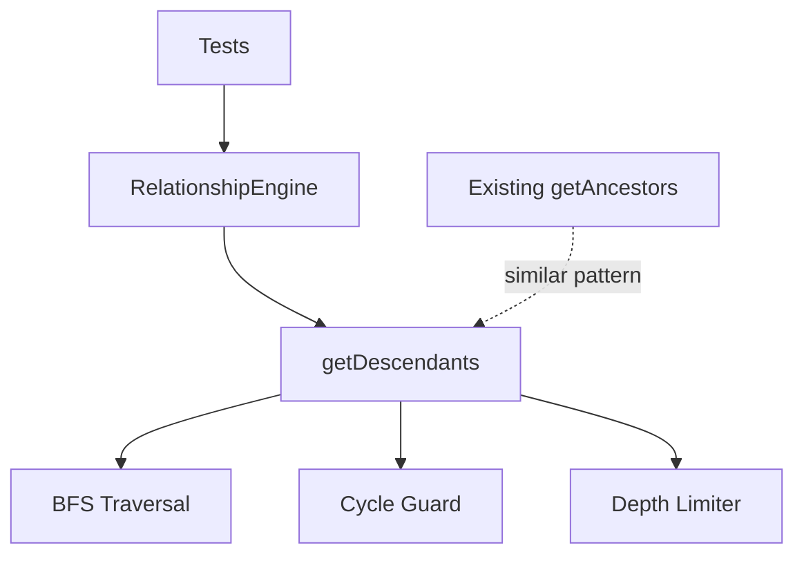

# Milestone 2.2: Descendant Traversal - Implementation Plan

**Status:** Ready for Implementation
**Priority:** Critical
**Estimated Time:** 2-3 days

---

## Overview

This document provides a comprehensive implementation plan for Milestone 2.2: Descendant Traversal, the second milestone in Phase 2 (Relationship Engine) of the Relations Obsidian plugin.

### Decision Summary

- **Approach:** Breadth-First Search (BFS) for generation-based traversal
- **Return Format:** Array of arrays (generations): `[[children], [grandchildren], [great-grandchildren], ...]`
- **Cycle Protection:** Visited set to prevent infinite loops
- **Depth Limiting:** Respect `maxDepth` from plugin settings
- **Ordering:** Breadth-first order within each generation for predictable results

---

## Goals

Implement depth-limited descendant computation that safely traverses child relationships down the tree, handling cycles gracefully and organizing results by generation level. This mirrors the ancestor traversal functionality but operates in the opposite direction.

---

## Architecture Overview

### Components to Modify



### File Structure

```
src/
├── relationship-engine.ts      # Modified: Add getDescendants method
├── relation-graph.ts           # Existing: Graph structure
├── cycle-detector.ts           # Existing: Cycle detection
└── main.ts                     # Existing: Plugin integration

tests/
├── relationship-engine.test.ts # Modified: Add descendant tests
├── cycle-detector.test.ts      # Existing: Cycle tests
└── incremental-updates.test.ts # Existing: Update tests
```

---

## Detailed Design

### 1. getDescendants Method

**File:** `src/relationship-engine.ts` (add to existing class)

```typescript
/**
 * Gets descendants of a file, organized by generation.
 *
 * Uses breadth-first search to traverse child relationships, organizing
 * results by generation level (children, grandchildren, great-grandchildren, etc.).
 * Includes cycle protection to prevent infinite loops.
 *
 * @param file - The file to get descendants for
 * @param maxDepth - Maximum depth to traverse (default: from settings)
 * @returns Array of arrays: [[children], [grandchildren], [great-grandchildren], ...]
 *
 * @example
 * // Given: D → C → B → A (A is child of B, B is child of C, C is child of D)
 * // getDescendants(D, 3) returns:
 * // [
 * //   [C],           // Generation 1: children
 * //   [B],           // Generation 2: grandchildren
 * //   [A]            // Generation 3: great-grandchildren
 * // ]
 *
 * @example
 * // Given: D → B, D → C; B → A, C → A (A has two parents B and C, both children of D)
 * // getDescendants(D, 2) returns:
 * // [
 * //   [B, C],        // Generation 1: children
 * //   [A]            // Generation 2: grandchildren (merged from both paths)
 * // ]
 */
getDescendants(file: TFile, maxDepth?: number): TFile[][] {
  const depth = maxDepth ?? this.graph.getMaxDepth();
  const result: TFile[][] = [];
  const visited = new Set<string>();

  // Mark starting file as visited to prevent cycles back to self
  visited.add(file.path);

  // BFS: current generation
  let currentGeneration = [file];

  for (let level = 0; level < depth; level++) {
    const nextGeneration: TFile[] = [];
    const seenInGeneration = new Set<string>();

    // Process all files in current generation
    for (const current of currentGeneration) {
      const children = this.graph.getChildren(current);

      for (const child of children) {
        // Skip if already visited (cycle protection)
        if (visited.has(child.path)) continue;

        // Skip if already added to this generation (deduplication)
        if (seenInGeneration.has(child.path)) continue;

        nextGeneration.push(child);
        seenInGeneration.add(child.path);
        visited.add(child.path);
      }
    }

    // If no more children, stop traversal
    if (nextGeneration.length === 0) break;

    result.push(nextGeneration);
    currentGeneration = nextGeneration;
  }

  return result;
}
```

**Design Rationale:**

**Why BFS instead of DFS?**
- BFS naturally organizes results by generation level
- Easier to limit depth (just count levels)
- Consistent ordering within generations
- Better for visualization (tree rendering by level)
- Mirrors the `getAncestors` implementation for consistency

**Why Array of Arrays?**
- Clearly separates generations (children vs grandchildren vs great-grandchildren)
- Makes UI rendering easier (can display each generation distinctly)
- Allows depth-based filtering
- Matches mental model of family trees
- Consistent with `getAncestors` return format

**Cycle Protection Strategy:**
- Global `visited` set prevents revisiting any node
- Prevents infinite loops in cyclic graphs
- Detects cycles without throwing errors
- Gracefully stops traversal when cycle encountered
- Same strategy as `getAncestors` for consistency

**Breadth-First Order:**
- Within each generation, nodes appear in the order they are discovered
- Order is deterministic (same for repeated calls)
- Natural left-to-right ordering in tree visualization
- Predictable and consistent behavior

---

## Test Specification

**File:** `tests/relationship-engine.test.ts` (add to existing file)

### Test Cases

```typescript
describe('RelationshipEngine - getDescendants', () => {
  describe('Linear Chains', () => {
    it('should return descendants for linear chain: D → C → B → A', () => {
      // Setup: D has child C, C has child B, B has child A
      // Test: getDescendants(D, 3)
      // Expect: [[C], [B], [A]]
    });

    it('should respect depth limit in linear chain', () => {
      // Setup: F → E → D → C → B → A
      // Test: getDescendants(F, 2)
      // Expect: [[E], [D]]
      // C, B, A should not be included
    });

    it('should return empty array for leaf node (no children)', () => {
      // Setup: A has no children
      // Test: getDescendants(A)
      // Expect: []
    });

    it('should handle depth 1 (immediate children only)', () => {
      // Setup: D → C → B → A
      // Test: getDescendants(D, 1)
      // Expect: [[C]]
    });
  });

  describe('Multiple Children (Tree Structures)', () => {
    it('should handle multiple children: A → B, A → C', () => {
      // Setup: A has children B and C
      // Test: getDescendants(A, 1)
      // Expect: [[B, C]] (both in same generation)
    });

    it('should merge descendants when paths converge: D → B, D → C; B → A, C → A', () => {
      // Setup:
      //     D
      //    / \
      //   B   C
      //    \ /
      //     A
      // Test: getDescendants(D, 2)
      // Expect: [[B, C], [A]]
      // A should appear only once even though reachable via two paths
    });

    it('should handle wide tree (many children per node)', () => {
      // Setup: Node A has 10 children, each with 5 children
      // Test: getDescendants(A, 2)
      // Expect: [[10 children], [50 grandchildren]]
      // Verify all are included and properly organized
    });

    it('should handle complex multi-child hierarchy', () => {
      // Setup:
      //       A
      //      / \
      //     B   C
      //    / \ / \
      //   D   E   F
      //        \ /
      //         G
      // Test: getDescendants(A, 3)
      // Verify all descendants at correct generation levels
    });
  });

  describe('Cycle Protection', () => {
    it('should stop at cycle without infinite loop: A → B → C → B', () => {
      // Setup: A → B → C → B (cycle between B and C)
      // Test: getDescendants(A, 10)
      // Expect: Should complete without hanging
      // Should not include B twice
    });

    it('should handle self-loop: A → B → B', () => {
      // Setup: A has child B, B has child B (self-loop)
      // Test: getDescendants(A)
      // Expect: [[B]]
      // Should not infinitely loop on B
    });

    it('should handle cycle to starting node: A → B → A', () => {
      // Setup: A has child B, B has child A
      // Test: getDescendants(A)
      // Expect: [[B]]
      // Should not include A again
    });

    it('should handle long cycle: A → B → C → D → E → C', () => {
      // Setup: Cycle exists at generation 4
      // Test: getDescendants(A, 10)
      // Expect: Should stop when cycle detected
      // Should include each node only once
    });

    it('should handle cycle in wide tree', () => {
      // Setup: A → B, A → C, A → D; B → E, C → E, D → E; E → B (cycle back)
      // Test: getDescendants(A, 5)
      // Expect: Should detect cycle and not hang
    });
  });

  describe('Edge Cases', () => {
    it('should handle empty graph', () => {
      // Setup: Empty graph
      // Test: getDescendants(A)
      // Expect: [] or graceful handling
    });

    it('should handle single node with no children', () => {
      // Setup: Isolated node A
      // Test: getDescendants(A)
      // Expect: []
    });

    it('should handle maxDepth = 0', () => {
      // Setup: A → B → C
      // Test: getDescendants(A, 0)
      // Expect: []
    });

    it('should handle maxDepth larger than tree depth', () => {
      // Setup: A → B → C (depth 2)
      // Test: getDescendants(A, 100)
      // Expect: [[B], [C]]
      // Should not error or return undefined generations
    });

    it('should use default maxDepth from settings when not provided', () => {
      // Setup: Settings has maxDepth = 5, tree has depth 10
      // Test: getDescendants(A) (no maxDepth parameter)
      // Expect: Should only traverse 5 levels
    });

    it('should handle node with many children (wide tree)', () => {
      // Setup: A has 100 children
      // Test: getDescendants(A, 1)
      // Expect: [[100 children]]
      // Should complete quickly
    });
  });

  describe('Generation Ordering', () => {
    it('should maintain consistent ordering within generation', () => {
      // Setup: A → B, A → C, A → D (multiple children)
      // Test: getDescendants(A, 1) multiple times
      // Expect: Same order each time (deterministic)
    });

    it('should maintain breadth-first order', () => {
      // Setup:
      //     A
      //    /|\
      //   B C D
      //   |   |
      //   E   F
      // Test: getDescendants(A, 2)
      // Expect: [[B, C, D], [E, F]]
      // E and F should appear in breadth-first order
    });

    it('should not have duplicates within same generation', () => {
      // Setup: Complex graph with multiple paths to same descendant
      // Test: getDescendants(A)
      // Expect: Each descendant appears exactly once per generation
    });
  });

  describe('Symmetry with getAncestors', () => {
    it('should mirror getAncestors for simple chain', () => {
      // Setup: A → B → C → D
      // Test:
      //   - getAncestors(A, 3) should return [[B], [C], [D]]
      //   - getDescendants(D, 3) should return [[C], [B], [A]]
      // Verify: Results are mirror images
    });

    it('should have same behavior for cycles', () => {
      // Setup: A → B → C → A (cycle)
      // Test both getAncestors(A) and getDescendants(A)
      // Expect: Both should handle cycle gracefully without hanging
    });

    it('should respect same maxDepth setting', () => {
      // Setup: Long chain or tree structure
      // Test: Both methods with same maxDepth
      // Expect: Both respect depth limit equally
    });
  });

  describe('Performance', () => {
    it('should process 1000-node lineage in <50ms', () => {
      // Setup: Linear chain of 1000 nodes
      // Test: getDescendants(rootNode, 1000)
      // Measure: Execution time
      // Expect: <50ms
    });

    it('should handle wide tree (100 children per level)', () => {
      // Setup: Node with 100 children, each with 100 children
      // Test: getDescendants(node, 2)
      // Expect: Completes quickly, no performance degradation
    });

    it('should handle deep tree (100 levels)', () => {
      // Setup: Linear chain of 100 nodes
      // Test: getDescendants(rootNode, 100)
      // Expect: Completes quickly with correct results
    });

    it('should perform similarly to getAncestors', () => {
      // Setup: Same graph structure
      // Test: Benchmark both methods
      // Expect: Similar performance characteristics
    });
  });
});
```

### Mock Data Helpers

```typescript
/**
 * Helper to create inverted linear chain: A ← B ← C ← D
 * (A has child B, B has child C, C has child D)
 *
 * @param length - Number of nodes in chain
 * @returns Mock graph with inverted linear chain
 */
function createDescendantChain(length: number): {
  graph: RelationGraph;
  files: TFile[];
} {
  const nodes = Array.from({ length }, (_, i) =>
    String.fromCharCode(65 + i) // A, B, C, D, ...
  );

  const relationships: [string, string][] = [];
  for (let i = 0; i < nodes.length - 1; i++) {
    // Inverted: child → parent (so parent has child as descendant)
    relationships.push([nodes[i + 1], nodes[i]]);
  }

  const { graph, files: fileMap } = createMockGraphWithRelationships(relationships);
  const files = nodes.map(name => fileMap.get(name)!);

  return { graph, files };
}

/**
 * Helper to create inverted diamond structure:
 *     A
 *    / \
 *   B   C
 *    \ /
 *     D
 */
function createDescendantDiamond(): {
  graph: RelationGraph;
  files: { A: TFile; B: TFile; C: TFile; D: TFile };
} {
  const relationships: [string, string][] = [
    ['B', 'A'], // B is child of A (A → B)
    ['C', 'A'], // C is child of A (A → C)
    ['D', 'B'], // D is child of B (B → D)
    ['D', 'C']  // D is child of C (C → D)
  ];

  const { graph, files } = createMockGraphWithRelationships(relationships);

  return {
    graph,
    files: {
      A: files.get('A')!,
      B: files.get('B')!,
      C: files.get('C')!,
      D: files.get('D')!
    }
  };
}

/**
 * Helper to create wide tree structure
 * Root node with many children, each with many children
 *
 * @param childrenPerNode - Number of children per node
 * @param depth - Depth of tree
 * @returns Mock graph with wide tree
 */
function createWideTree(childrenPerNode: number, depth: number): {
  graph: RelationGraph;
  root: TFile;
  totalNodes: number;
} {
  // Implementation creates tree structure with specified branching factor
  // ...
}
```

---

## Implementation Checklist

### Phase 1: Core Implementation
- [ ] Modify `src/relationship-engine.ts`
  - [ ] Implement `getDescendants()` method
  - [ ] Implement BFS traversal algorithm (mirror of getAncestors)
  - [ ] Add cycle protection with visited set
  - [ ] Add depth limiting logic
  - [ ] Add JSDoc documentation with examples
  - [ ] Ensure code style matches `getAncestors`

### Phase 2: Testing
- [ ] Modify `tests/relationship-engine.test.ts`
  - [ ] Add mock data helpers for descendant structures
  - [ ] Write "Linear Chains" test suite
  - [ ] Write "Multiple Children" test suite
  - [ ] Write "Cycle Protection" test suite
  - [ ] Write "Edge Cases" test suite
  - [ ] Write "Generation Ordering" test suite
  - [ ] Write "Symmetry with getAncestors" test suite
  - [ ] Write "Performance" test suite
- [ ] Ensure all new tests pass
- [ ] Verify test coverage >80%
- [ ] Ensure all existing tests still pass

### Phase 3: Documentation
- [ ] Add JSDoc comments to method
- [ ] Document algorithm in code comments
- [ ] Add usage examples in comments
- [ ] Update README with descendant traversal features
- [ ] Document symmetry with ancestor traversal

### Phase 4: Validation
- [ ] Run all tests
- [ ] Verify performance benchmarks
- [ ] Check code coverage
- [ ] Manual testing with test vault
- [ ] Verify no breaking changes

---

## Acceptance Criteria

From [`docs/implementation-plan.md`](../docs/implementation-plan.md:172):

- ✅ Returns correct descendants up to specified depth
- ✅ Stops at cycles without infinite loop
- ✅ Handles multiple children correctly
- ✅ Returns empty array for leaf nodes (no children)
- ✅ Breadth-first order within each generation

**Additional Criteria:**
- ✅ All tests pass
- ✅ Test coverage >80%
- ✅ Generation-based organization (array of arrays)
- ✅ No duplicates within same generation
- ✅ Respects `maxDepth` setting from plugin config
- ✅ Mirrors `getAncestors` implementation and behavior
- ✅ Performance: processes 1000-node lineage in <50ms
- ✅ No breaking changes to existing APIs

---

## Performance Considerations

### Time Complexity
- **Best case (linear chain):** O(d) where d = depth
- **Worst case (wide tree):** O(b^d) where b = branching factor, d = depth
- **With visited set:** O(V) where V = unique nodes visited (at most all nodes in graph)
- **Same as getAncestors:** O(V + E) where E = edges

### Space Complexity
- **Visited set:** O(V) where V = nodes visited
- **Result array:** O(D) where D = total descendants
- **Current generation:** O(b^d) in worst case
- **Same as getAncestors**

### Optimizations
- Visited set prevents redundant exploration
- Early termination when no more children
- Deduplication within each generation
- BFS is naturally breadth-limited
- Same optimization strategy as `getAncestors`

### Benchmarks (Target)
- Linear chain (100 nodes): <5ms
- Linear chain (1000 nodes): <50ms
- Wide tree (10 children/level, 5 levels): <20ms
- Diamond structure (100 nodes): <30ms
- **Should match getAncestors performance**

---

## Edge Cases & Considerations

### 1. Multiple Paths to Same Descendant
**Scenario:** Node D has children B and C, both B and C have child A
**Handling:** A appears only once in generation 2 (deduplication)
**Implementation:** Use `seenInGeneration` set

### 2. Cycles in Descendants
**Scenario:** A → B → C → B (cycle)
**Handling:** Visited set prevents infinite loop, traversal stops gracefully
**Implementation:** Global `visited` set across all generations

### 3. Depth Exceeds Tree Depth
**Scenario:** maxDepth = 100, but tree only has 5 levels
**Handling:** Returns all available descendants, stops when no more children
**Implementation:** `if (nextGeneration.length === 0) break;`

### 4. maxDepth = 0
**Scenario:** User sets depth to 0
**Handling:** Returns empty array (no generations)
**Implementation:** Loop runs 0 times

### 5. Undefined maxDepth
**Scenario:** Method called without maxDepth parameter
**Handling:** Uses default from plugin settings
**Implementation:** `const depth = maxDepth ?? this.graph.getMaxDepth();`

### 6. Child Links to Non-existent Files
**Scenario:** Node references child that doesn't exist
**Handling:** Already handled by `RelationGraph.getChildren()` (filters out nulls)
**Implementation:** No changes needed

### 7. Wide vs Deep Trees
**Scenario:** Tree with 1000 children at one level vs 1000 levels deep
**Handling:** BFS handles both efficiently with visited set
**Implementation:** Same as `getAncestors` - naturally efficient

---

## Testing Strategy

### Unit Tests
- **Location:** `tests/relationship-engine.test.ts`
- **Coverage:** All aspects of `getDescendants()` method
- **Focus:** Algorithm correctness, cycle handling, edge cases
- **Comparison:** Test symmetry with `getAncestors()`

### Integration Tests
- **Test with:** Real `RelationGraph` instance
- **Verify:** Integration with cycle detector
- **Check:** Settings integration works correctly
- **Validate:** Works alongside `getAncestors()`

### Performance Tests
- **Benchmark:** Various graph structures and sizes
- **Measure:** Execution time for different scenarios
- **Target:** <50ms for 1000-node lineage
- **Compare:** Should match `getAncestors` performance

### Regression Tests
- **Ensure:** All existing tests still pass
- **Verify:** `getAncestors` unaffected
- **Check:** Cycle detection still works
- **Validate:** Incremental updates still work

---

## Success Metrics

- ✅ All acceptance criteria met
- ✅ All unit tests passing (new and existing)
- ✅ Test coverage >80%
- ✅ Performance benchmarks met (<50ms for 1000 nodes)
- ✅ Zero breaking changes
- ✅ Mirrors `getAncestors` in quality and behavior
- ✅ Code review approved
- ✅ Documentation complete

---

## Dependencies

### External Dependencies
- `obsidian` - TFile type (already installed)
- `vitest` - Testing framework (already installed ✅)

### Internal Dependencies
- `RelationGraph` - Graph structure to traverse
- `getChildren()` method - To get child nodes
- `getMaxDepth()` method - For default depth (already implemented in Milestone 2.1)
- Plugin settings - For default `maxDepth` value

---

## Risk Assessment

### Potential Issues

1. **Risk:** BFS may be slow for very wide trees (many children)
   - **Mitigation:** Depth limiting prevents excessive exploration
   - **Benchmark:** Test with wide trees (100+ children per level)
   - **Fallback:** Can optimize with early termination strategies

2. **Risk:** Memory usage with very large result sets
   - **Mitigation:** Depth limiting and visited set
   - **Monitoring:** Add memory usage tests
   - **Note:** Same mitigation as `getAncestors`

3. **Risk:** Inconsistent ordering within generations
   - **Mitigation:** `getChildren()` returns consistent order
   - **Testing:** Verify deterministic ordering
   - **Note:** Breadth-first order is natural and predictable

4. **Risk:** Breaking existing functionality
   - **Mitigation:** Only additive changes, no modifications to existing code
   - **Testing:** Run all existing tests
   - **Validation:** Regression test suite

5. **Risk:** Implementation diverges from getAncestors pattern
   - **Mitigation:** Follow same structure and patterns as `getAncestors`
   - **Review:** Code review to ensure consistency
   - **Testing:** Symmetry tests to verify parallel behavior

---

## Implementation Notes

### BFS Algorithm Details

**Breadth-First Search** is ideal for this use case because:
1. **Level-by-level traversal:** Naturally separates generations
2. **Shortest path:** Always finds descendants at their nearest generation
3. **Predictable memory:** Bounded by width of tree at each level
4. **Easy depth limiting:** Just count the levels
5. **Consistency:** Mirrors `getAncestors` implementation

**Algorithm Steps:**
1. Initialize with starting file
2. Mark starting file as visited (prevent cycles back to self)
3. For each level (up to maxDepth):
   - Get all children of current generation
   - Filter out visited nodes (cycle protection)
   - Filter out duplicates within generation (deduplication)
   - Add to results
   - Move to next generation
4. Stop when no more children or depth limit reached

### Symmetry with getAncestors

**Key Similarities:**
- Same algorithm structure (BFS)
- Same cycle protection strategy (visited set)
- Same return format (array of arrays)
- Same depth limiting approach
- Same edge case handling

**Key Difference:**
- Direction: `getAncestors` traverses up (parents), `getDescendants` traverses down (children)
- Method called: `graph.getParents()` vs `graph.getChildren()`

**Implementation Pattern:**
```typescript
// getAncestors pattern:
const parents = this.graph.getParents(current);
for (const parent of parents) {
  // ... cycle protection and deduplication
  nextGeneration.push(parent);
}

// getDescendants pattern (mirror):
const children = this.graph.getChildren(current);
for (const child of children) {
  // ... cycle protection and deduplication (same logic)
  nextGeneration.push(child);
}
```

### Code Reuse Opportunities

While the two methods are very similar, they should remain separate because:
- **Clarity:** Separate methods are more readable
- **Semantics:** Different conceptual operations (up vs down)
- **Future flexibility:** May need different optimizations
- **API clarity:** Clear method names for users

However, we could extract common logic in future optimization (out of scope):
- BFS traversal helper function
- Cycle protection utilities
- Generation deduplication logic

---

## Future Enhancements (Out of Scope)

These features are **not** part of Milestone 2.2 but may be added in future:

- [ ] Sorting options (alphabetical, by creation date, etc.)
- [ ] Filtering by tags, folders, or custom criteria
- [ ] Path tracking (show which path led to each descendant)
- [ ] Caching frequently accessed descendant chains
- [ ] Lazy loading for very deep/wide trees
- [ ] Descendant statistics (total count, max depth, width, etc.)
- [ ] Unified traversal helper (DRY for getAncestors/getDescendants)
- [ ] Iterative/generator-based API for memory efficiency

---

## Next Steps After Completion

1. ✅ Complete Milestone 2.2 implementation
2. Update [`docs/implementation-plan.md`](../docs/implementation-plan.md) with completion status
3. Proceed to Milestone 2.3 (Sibling Resolution)
   - Will use both `getAncestors` and `getDescendants` (get siblings via shared parents)
   - Can reuse testing infrastructure
4. Consider future optimizations:
   - Extract common BFS logic
   - Add caching layer for frequently accessed relationships

---

## Appendix: Example Usage

```typescript
// In a future feature (sidebar view, codeblock, etc.)

const plugin = this.app.plugins.getPlugin('relations-obsidian');
const engine = plugin.relationshipEngine;

// Get descendants of current file
const currentFile = this.app.workspace.getActiveFile();
const descendants = engine.getDescendants(currentFile);

// Display in UI
console.log('Descendants by generation:');
descendants.forEach((generation, index) => {
  console.log(`Generation ${index + 1}:`, generation.map(f => f.basename));
});

// Example output:
// Generation 1: ["Child A", "Child B"]
// Generation 2: ["Grandchild C"]
// Generation 3: ["Great-grandchild D", "Great-grandchild E"]

// Limit depth
const immediateChildren = engine.getDescendants(currentFile, 1);
console.log('Children:', immediateChildren[0]?.map(f => f.basename));

// Compare with ancestors
const ancestors = engine.getAncestors(currentFile);
console.log('Ancestors:', ancestors);
console.log('Descendants:', descendants);

// Check for cycles before traversal (optional)
const cycleInfo = plugin.relationGraph.detectCycle(currentFile);
if (cycleInfo) {
  console.warn('Cycle detected:', cycleInfo.description);
}
```

---

## Appendix: Algorithm Walkthrough

### Example: Diamond Structure (Inverted)

**Graph:**
```
    A
   / \
  B   C
   \ /
    D
```

**Call:** `getDescendants(A, 3)`

**Execution:**

**Level 0 (Initialization):**
- `visited = {A}`
- `currentGeneration = [A]`
- `result = []`

**Level 1:**
- Get children of A: `[B, C]`
- B not visited, not in generation → add to nextGeneration
- C not visited, not in generation → add to nextGeneration
- `visited = {A, B, C}`
- `result = [[B, C]]`
- `currentGeneration = [B, C]`

**Level 2:**
- Get children of B: `[D]`
- D not visited, not in generation → add to nextGeneration
- Get children of C: `[D]`
- D not visited, but already in generation → skip (deduplication)
- `visited = {A, B, C, D}`
- `result = [[B, C], [D]]`
- `currentGeneration = [D]`

**Level 3:**
- Get children of D: `[]`
- No children found
- `nextGeneration = []`
- Loop breaks

**Return:** `[[B, C], [D]]`

**Note:** This is exactly symmetrical to the `getAncestors` example, just in the opposite direction.

---

## Appendix: Comparison with getAncestors

### Side-by-Side Comparison

| Aspect | getAncestors | getDescendants |
|--------|-------------|----------------|
| **Direction** | Upward (parents) | Downward (children) |
| **Method used** | `graph.getParents()` | `graph.getChildren()` |
| **Return format** | `[[parents], [grandparents], ...]` | `[[children], [grandchildren], ...]` |
| **Algorithm** | BFS | BFS (same) |
| **Cycle protection** | Visited set | Visited set (same) |
| **Depth limiting** | maxDepth parameter | maxDepth parameter (same) |
| **Performance** | O(V + E) | O(V + E) (same) |
| **Use case** | "Who are my ancestors?" | "Who are my descendants?" |
| **Tree analogy** | Going up the family tree | Going down the family tree |

### Test Symmetry Example

```typescript
// Given a simple chain: D → C → B → A
// (D is parent of C, C is parent of B, B is parent of A)

// From A's perspective (looking up):
const ancestors = engine.getAncestors(A, 3);
// Result: [[B], [C], [D]]

// From D's perspective (looking down):
const descendants = engine.getDescendants(D, 3);
// Result: [[C], [B], [A]]

// Notice: descendants is the reverse path of ancestors
```

---

**Document Version:** 1.0
**Last Updated:** 2025-11-15
**Status:** Ready for Implementation
