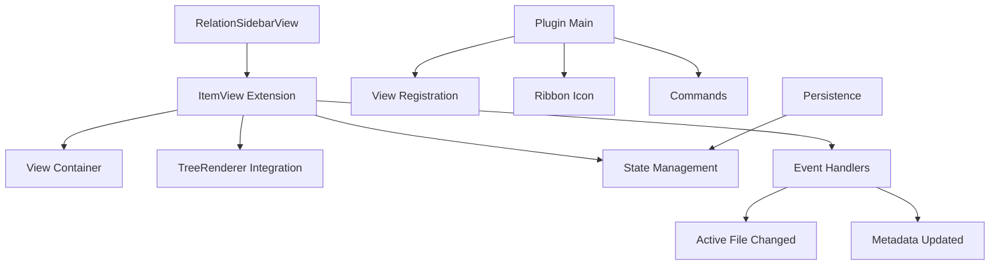

# Milestone 4.1: Basic Sidebar View - Implementation Plan

**Status:** Ready for Implementation  
**Priority:** High  
**Estimated Time:** 2-3 days

---

## Overview

This document provides a comprehensive implementation plan for Milestone 4.1: Basic Sidebar View, the first milestone in Phase 4 (Sidebar View) of the Relations Obsidian plugin.

### Decision Summary

- **Approach:** Extend Obsidian's ItemView class for sidebar integration
- **Update Strategy:** Auto-update on active file changes
- **State Management:** Persist view state and preferences across sessions
- **Initial Mode:** Default to ancestor view (can be changed later)
- **Rendering:** Use existing TreeRenderer from Milestone 3.2

---

## Goals

Create a dedicated sidebar view that displays relationship trees for the currently active note. The view should integrate seamlessly with Obsidian's UI, update automatically when switching between notes, and persist its state across sessions.

---

## Architecture Overview

### Components to Create



### File Structure

```
src/
├── sidebar-view.ts              # New: Sidebar view implementation
├── main.ts                      # Modified: Register view and commands
├── tree-renderer.ts             # Existing: DOM tree renderer
├── tree-model.ts                # Existing: Tree data structures
└── types.ts                     # Modified: Add view types

styles.css                       # Modified: Add sidebar-specific styles

tests/
└── sidebar-view.test.ts         # New: Sidebar view tests (optional for this milestone)
```

---

## Detailed Design

### 1. RelationSidebarView Class

**File:** `src/sidebar-view.ts` (new file)

```typescript
import { ItemView, WorkspaceLeaf, TFile } from 'obsidian';
import type ParentRelationPlugin from './main';
import { TreeRenderer } from './tree-renderer';
import { buildAncestorTree } from './tree-model';

/**
 * View type identifier for the relation sidebar
 */
export const VIEW_TYPE_RELATION_SIDEBAR = 'relation-sidebar-view';

/**
 * Display mode for the sidebar
 */
export enum SidebarDisplayMode {
  ANCESTORS = 'ancestors',
  DESCENDANTS = 'descendants',
  FULL_LINEAGE = 'full-lineage',
  SIBLINGS = 'siblings'
}

/**
 * Sidebar view state (persisted across sessions)
 */
export interface SidebarViewState {
  /** Current display mode */
  mode: SidebarDisplayMode;
  
  /** Whether the view is pinned to a specific file */
  pinned: boolean;
  
  /** Path of pinned file (if pinned) */
  pinnedFilePath?: string;
}

/**
 * Default view state
 */
const DEFAULT_VIEW_STATE: SidebarViewState = {
  mode: SidebarDisplayMode.ANCESTORS,
  pinned: false
};

/**
 * Sidebar view for displaying relationship trees.
 * 
 * Features:
 * - Auto-updates when active note changes
 * - Supports multiple display modes
 * - Can be pinned to a specific note
 * - Persists state across sessions
 */
export class RelationSidebarView extends ItemView {
  private plugin: ParentRelationPlugin;
  private renderer: TreeRenderer;
  private currentFile: TFile | null = null;
  private viewState: SidebarViewState;
  private contentContainer: HTMLElement;

  constructor(leaf: WorkspaceLeaf, plugin: ParentRelationPlugin) {
    super(leaf);
    this.plugin = plugin;
    this.viewState = { ...DEFAULT_VIEW_STATE };
    
    // Initialize tree renderer
    this.renderer = new TreeRenderer(this.app, {
      collapsible: true,
      initiallyCollapsed: false,
      enableNavigation: true,
      showCycleIndicators: true,
      cssPrefix: 'relation-sidebar'
    });
  }

  /**
   * Returns the view type identifier.
   */
  getViewType(): string {
    return VIEW_TYPE_RELATION_SIDEBAR;
  }

  /**
   * Returns the display text for the view.
   */
  getDisplayText(): string {
    return 'Relation Explorer';
  }

  /**
   * Returns the icon for the view.
   */
  getIcon(): string {
    return 'git-fork'; // Obsidian's built-in icon
  }

  /**
   * Called when the view is opened.
   */
  async onOpen(): Promise<void> {
    const container = this.containerEl.children[1];
    container.empty();
    container.addClass('relation-sidebar-container');

    // Create header
    this.createHeader(container);

    // Create content container
    this.contentContainer = container.createDiv('relation-sidebar-content');

    // Register event handlers
    this.registerEventHandlers();

    // Initial render
    this.updateView();
  }

  /**
   * Called when the view is closed.
   */
  async onClose(): Promise<void> {
    // Cleanup renderer
    this.renderer.destroy();
  }

  /**
   * Creates the header section with title and controls.
   */
  private createHeader(container: HTMLElement): void {
    const header = container.createDiv('relation-sidebar-header');

    // Title
    const title = header.createDiv('relation-sidebar-title');
    title.setText('Relation Explorer');

    // We'll add mode selector and controls in Milestone 4.2
    // For now, just show the title
  }

  /**
   * Registers event handlers for auto-updating.
   */
  private registerEventHandlers(): void {
    // Update when active file changes
    this.registerEvent(
      this.app.workspace.on('active-leaf-change', () => {
        if (!this.viewState.pinned) {
          this.updateView();
        }
      })
    );

    // Update when file content changes (metadata)
    this.registerEvent(
      this.app.metadataCache.on('changed', (file: TFile) => {
        // Only update if the changed file is currently displayed
        if (this.currentFile && file.path === this.currentFile.path) {
          this.updateView();
        }
      })
    );

    // Update when file is renamed
    this.registerEvent(
      this.app.vault.on('rename', (file, oldPath) => {
        if (file instanceof TFile) {
          // Update if the renamed file is currently displayed
          if (this.currentFile && oldPath === this.currentFile.path) {
            this.currentFile = file;
            this.updateView();
          }
          
          // Update if pinned file was renamed
          if (this.viewState.pinned && oldPath === this.viewState.pinnedFilePath) {
            this.viewState.pinnedFilePath = file.path;
            this.updateView();
          }
        }
      })
    );

    // Update when file is deleted
    this.registerEvent(
      this.app.vault.on('delete', (file) => {
        if (file instanceof TFile) {
          // Clear view if displayed file is deleted
          if (this.currentFile && file.path === this.currentFile.path) {
            this.currentFile = null;
            this.updateView();
          }
          
          // Unpin if pinned file is deleted
          if (this.viewState.pinned && file.path === this.viewState.pinnedFilePath) {
            this.viewState.pinned = false;
            this.viewState.pinnedFilePath = undefined;
            this.updateView();
          }
        }
      })
    );
  }

  /**
   * Updates the view content based on current state.
   */
  private updateView(): void {
    // Clear content
    this.contentContainer.empty();

    // Determine which file to display
    const fileToDisplay = this.getFileToDisplay();

    if (!fileToDisplay) {
      this.showEmptyState();
      return;
    }

    // Update current file
    this.currentFile = fileToDisplay;

    // Build and render tree based on mode
    this.renderTree(fileToDisplay);
  }

  /**
   * Gets the file to display based on view state.
   */
  private getFileToDisplay(): TFile | null {
    // If pinned, use pinned file
    if (this.viewState.pinned && this.viewState.pinnedFilePath) {
      const pinnedFile = this.app.vault.getAbstractFileByPath(
        this.viewState.pinnedFilePath
      );
      if (pinnedFile instanceof TFile) {
        return pinnedFile;
      }
      // Pinned file not found, unpin
      this.viewState.pinned = false;
      this.viewState.pinnedFilePath = undefined;
    }

    // Otherwise, use active file
    const activeFile = this.app.workspace.getActiveFile();
    return activeFile;
  }

  /**
   * Renders the tree for the given file.
   */
  private renderTree(file: TFile): void {
    try {
      // Build tree based on current mode
      const tree = this.buildTreeForMode(file);

      if (!tree) {
        this.showNoRelationsState();
        return;
      }

      // Render tree
      this.renderer.render(tree, this.contentContainer);

    } catch (error) {
      console.error('[Relation Explorer] Error rendering tree:', error);
      this.showErrorState(error);
    }
  }

  /**
   * Builds a tree based on the current display mode.
   */
  private buildTreeForMode(file: TFile) {
    const engine = this.plugin.relationshipEngine;
    const graph = this.plugin.relationGraph;

    switch (this.viewState.mode) {
      case SidebarDisplayMode.ANCESTORS:
        return buildAncestorTree(file, engine, graph, {
          maxDepth: this.plugin.settings.maxDepth,
          detectCycles: true,
          includeMetadata: true
        });

      case SidebarDisplayMode.DESCENDANTS:
        // Will be implemented in future milestone
        // For now, fall back to ancestors
        return buildAncestorTree(file, engine, graph, {
          maxDepth: this.plugin.settings.maxDepth,
          detectCycles: true,
          includeMetadata: true
        });

      case SidebarDisplayMode.FULL_LINEAGE:
        // Will be implemented in future milestone
        return buildAncestorTree(file, engine, graph, {
          maxDepth: this.plugin.settings.maxDepth,
          detectCycles: true,
          includeMetadata: true
        });

      case SidebarDisplayMode.SIBLINGS:
        // Will be implemented in future milestone
        return buildAncestorTree(file, engine, graph, {
          maxDepth: this.plugin.settings.maxDepth,
          detectCycles: true,
          includeMetadata: true
        });

      default:
        return buildAncestorTree(file, engine, graph, {
          maxDepth: this.plugin.settings.maxDepth,
          detectCycles: true,
          includeMetadata: true
        });
    }
  }

  /**
   * Shows empty state when no file is active.
   */
  private showEmptyState(): void {
    const empty = this.contentContainer.createDiv('relation-sidebar-empty');
    empty.createEl('p', {
      text: 'No active file',
      cls: 'relation-sidebar-empty-text'
    });
    empty.createEl('p', {
      text: 'Open a note to see its relationships',
      cls: 'relation-sidebar-empty-hint'
    });
  }

  /**
   * Shows state when file has no relations.
   */
  private showNoRelationsState(): void {
    const empty = this.contentContainer.createDiv('relation-sidebar-empty');
    empty.createEl('p', {
      text: 'No relationships found',
      cls: 'relation-sidebar-empty-text'
    });
    empty.createEl('p', {
      text: `This note has no ${this.viewState.mode}`,
      cls: 'relation-sidebar-empty-hint'
    });
  }

  /**
   * Shows error state.
   */
  private showErrorState(error: any): void {
    const errorContainer = this.contentContainer.createDiv('relation-sidebar-error');
    errorContainer.createEl('p', {
      text: 'Error loading relationships',
      cls: 'relation-sidebar-error-text'
    });
    errorContainer.createEl('p', {
      text: error.message || 'Unknown error',
      cls: 'relation-sidebar-error-details'
    });
  }

  /**
   * Gets the current view state for persistence.
   */
  async getState(): Promise<any> {
    return {
      ...this.viewState
    };
  }

  /**
   * Restores view state from saved data.
   */
  async setState(state: any, result: any): Promise<void> {
    if (state) {
      this.viewState = {
        ...DEFAULT_VIEW_STATE,
        ...state
      };
    }
    
    await super.setState(state, result);
    
    // Update view with restored state
    this.updateView();
  }

  /**
   * Refreshes the view (forces re-render).
   */
  refresh(): void {
    this.updateView();
  }

  /**
   * Sets the display mode.
   */
  setMode(mode: SidebarDisplayMode): void {
    this.viewState.mode = mode;
    this.updateView();
  }

  /**
   * Pins the view to the current file.
   */
  pin(): void {
    if (this.currentFile) {
      this.viewState.pinned = true;
      this.viewState.pinnedFilePath = this.currentFile.path;
      this.updateView();
    }
  }

  /**
   * Unpins the view.
   */
  unpin(): void {
    this.viewState.pinned = false;
    this.viewState.pinnedFilePath = undefined;
    this.updateView();
  }

  /**
   * Checks if the view is currently pinned.
   */
  isPinned(): boolean {
    return this.viewState.pinned;
  }
}
```

**Design Rationale:**

**Why extend ItemView?**
- Standard Obsidian pattern for sidebar views
- Provides lifecycle hooks (onOpen, onClose)
- Integrates with workspace layout
- Automatic state persistence support

**Auto-update Strategy:**
- Listen to `active-leaf-change` for file switches
- Listen to `metadata-cache:changed` for content updates
- Only update if displayed file is affected (performance)
- Respect pinned state (don't switch when pinned)

**State Management:**
- `getState()` and `setState()` for persistence
- View mode and pin state saved
- Restored on plugin reload or Obsidian restart

---

### 2. Plugin Integration

**File:** `src/main.ts` (modifications)

Add imports at the top:
```typescript
import { VIEW_TYPE_RELATION_SIDEBAR, RelationSidebarView } from './sidebar-view';
```

Add to `onload()` method after initializing the relationship engine:
```typescript
// Register sidebar view
this.registerView(
  VIEW_TYPE_RELATION_SIDEBAR,
  (leaf) => new RelationSidebarView(leaf, this)
);

// Add ribbon icon to toggle sidebar
this.addRibbonIcon('git-fork', 'Toggle Relation Explorer', async () => {
  await this.toggleSidebar();
});

// Add command to open sidebar
this.addCommand({
  id: 'open-relation-sidebar',
  name: 'Open Relation Explorer',
  callback: async () => {
    await this.activateSidebar();
  }
});

// Add command to toggle sidebar
this.addCommand({
  id: 'toggle-relation-sidebar',
  name: 'Toggle Relation Explorer',
  callback: async () => {
    await this.toggleSidebar();
  }
});
```

Add to `onunload()` method:
```typescript
// Detach sidebar views
this.app.workspace.detachLeavesOfType(VIEW_TYPE_RELATION_SIDEBAR);
```

Add new methods to the plugin class:
```typescript
/**
 * Activates the sidebar view (opens if not already open).
 */
async activateSidebar(): Promise<void> {
  const { workspace } = this.app;

  // Check if view is already open
  let leaf = workspace.getLeavesOfType(VIEW_TYPE_RELATION_SIDEBAR)[0];

  if (!leaf) {
    // Create new leaf in right sidebar
    const rightLeaf = workspace.getRightLeaf(false);
    if (rightLeaf) {
      await rightLeaf.setViewState({
        type: VIEW_TYPE_RELATION_SIDEBAR,
        active: true
      });
      leaf = rightLeaf;
    }
  }

  // Reveal the leaf
  if (leaf) {
    workspace.revealLeaf(leaf);
  }
}

/**
 * Toggles the sidebar view (open/close).
 */
async toggleSidebar(): Promise<void> {
  const { workspace } = this.app;
  const leaves = workspace.getLeavesOfType(VIEW_TYPE_RELATION_SIDEBAR);

  if (leaves.length > 0) {
    // Close all sidebar views
    leaves.forEach(leaf => leaf.detach());
  } else {
    // Open sidebar
    await this.activateSidebar();
  }
}
```

---

### 3. Styling

**File:** `styles.css` (additions)

```css
/* ============================================
   Relation Sidebar Styles
   ============================================ */

/* Sidebar Container */
.relation-sidebar-container {
  display: flex;
  flex-direction: column;
  height: 100%;
  padding: 0;
}

/* Sidebar Header */
.relation-sidebar-header {
  padding: 8px 16px;
  border-bottom: 1px solid var(--background-modifier-border);
  flex-shrink: 0;
}

.relation-sidebar-title {
  font-weight: 600;
  font-size: var(--font-ui-medium);
  color: var(--text-normal);
}

/* Sidebar Content */
.relation-sidebar-content {
  flex: 1;
  overflow-y: auto;
  overflow-x: hidden;
  padding: 8px;
}

/* Empty State */
.relation-sidebar-empty {
  display: flex;
  flex-direction: column;
  align-items: center;
  justify-content: center;
  height: 100%;
  text-align: center;
  padding: 20px;
  color: var(--text-muted);
}

.relation-sidebar-empty-text {
  font-size: var(--font-ui-medium);
  margin-bottom: 8px;
  color: var(--text-normal);
}

.relation-sidebar-empty-hint {
  font-size: var(--font-ui-small);
  color: var(--text-muted);
}

/* Error State */
.relation-sidebar-error {
  padding: 16px;
  background-color: var(--background-secondary);
  border: 1px solid var(--background-modifier-error);
  border-radius: 4px;
  margin: 8px;
}

.relation-sidebar-error-text {
  color: var(--text-error);
  font-weight: 600;
  margin-bottom: 8px;
}

.relation-sidebar-error-details {
  color: var(--text-muted);
  font-size: var(--font-ui-small);
  font-family: var(--font-monospace);
}

/* Tree Rendering in Sidebar (reuse existing tree styles) */
.relation-sidebar-content .relation-sidebar-node {
  /* Uses styles from relation-tree-node */
}

.relation-sidebar-content .relation-sidebar-node-content {
  /* Uses styles from relation-tree-node-content */
}

/* Scrollbar styling for sidebar */
.relation-sidebar-content::-webkit-scrollbar {
  width: 10px;
}

.relation-sidebar-content::-webkit-scrollbar-track {
  background: transparent;
}

.relation-sidebar-content::-webkit-scrollbar-thumb {
  background: var(--background-modifier-border);
  border-radius: 5px;
}

.relation-sidebar-content::-webkit-scrollbar-thumb:hover {
  background: var(--background-modifier-border-hover);
}
```

---

## Test Specification

### Manual Testing Checklist

Since this milestone focuses on basic functionality, manual testing is sufficient:

1. **View Opening:**
   - [ ] Click ribbon icon opens sidebar
   - [ ] Command palette "Open Relation Explorer" works
   - [ ] View appears in right sidebar
   - [ ] View has correct title and icon

2. **Auto-Update:**
   - [ ] Switching between notes updates the tree
   - [ ] Tree shows correct ancestors for active note
   - [ ] Metadata changes update the tree
   - [ ] File renames update the tree

3. **State Persistence:**
   - [ ] Sidebar state persists after closing/reopening
   - [ ] View location persists (stays in sidebar)
   - [ ] Reload Obsidian - view state restored

4. **Empty States:**
   - [ ] No active file shows "No active file" message
   - [ ] File with no parents shows "No relationships" message

5. **Error Handling:**
   - [ ] Deleting active file handles gracefully
   - [ ] Invalid graph state doesn't crash view

6. **Close/Toggle:**
   - [ ] Toggle command closes/opens view
   - [ ] Ribbon icon closes/opens view
   - [ ] Closing view detaches properly

---

## Implementation Checklist

### Phase 1: Core View Implementation
- [ ] Create `src/sidebar-view.ts`
  - [ ] Define `VIEW_TYPE_RELATION_SIDEBAR` constant
  - [ ] Define `SidebarDisplayMode` enum
  - [ ] Define `SidebarViewState` interface
  - [ ] Implement `RelationSidebarView` class
  - [ ] Implement `getViewType()`, `getDisplayText()`, `getIcon()`
  - [ ] Implement `onOpen()` and `onClose()` lifecycle methods
  - [ ] Create header section
  - [ ] Create content container

### Phase 2: Event Handlers
- [ ] Implement auto-update system
  - [ ] Register `active-leaf-change` handler
  - [ ] Register `metadata-cache:changed` handler
  - [ ] Register `vault:rename` handler
  - [ ] Register `vault:delete` handler
  - [ ] Implement `updateView()` method
  - [ ] Implement `getFileToDisplay()` logic

### Phase 3: Tree Rendering
- [ ] Implement tree rendering
  - [ ] Initialize `TreeRenderer` instance
  - [ ] Implement `renderTree()` method
  - [ ] Implement `buildTreeForMode()` method
  - [ ] Handle empty state
  - [ ] Handle error state
  - [ ] Handle no-relations state

### Phase 4: State Management
- [ ] Implement persistence
  - [ ] Implement `getState()` method
  - [ ] Implement `setState()` method
  - [ ] Test state persistence

### Phase 5: Plugin Integration
- [ ] Modify `src/main.ts`
  - [ ] Import sidebar view classes
  - [ ] Register view type
  - [ ] Add ribbon icon
  - [ ] Add "Open Relation Explorer" command
  - [ ] Add "Toggle Relation Explorer" command
  - [ ] Implement `activateSidebar()` method
  - [ ] Implement `toggleSidebar()` method
  - [ ] Add unload cleanup

### Phase 6: Styling
- [ ] Add sidebar styles to `styles.css`
  - [ ] Container styles
  - [ ] Header styles
  - [ ] Content area styles
  - [ ] Empty state styles
  - [ ] Error state styles
  - [ ] Scrollbar styles

### Phase 7: Testing
- [ ] Manual testing
  - [ ] Test view opening/closing
  - [ ] Test auto-update on file change
  - [ ] Test auto-update on metadata change
  - [ ] Test state persistence
  - [ ] Test empty states
  - [ ] Test error handling
  - [ ] Test on both light and dark themes

### Phase 8: Documentation
- [ ] Add JSDoc comments to all methods
- [ ] Document view lifecycle
- [ ] Add usage examples
- [ ] Update README with sidebar features

---

## Acceptance Criteria

From [`docs/implementation-plan.md`](../docs/implementation-plan.md:397):

- ✅ View appears in sidebar when opened
- ✅ Shows relationship tree for currently active note
- ✅ Updates when switching between notes
- ✅ Can be closed and reopened
- ✅ Persists state across Obsidian sessions
- ✅ Ribbon icon to toggle view

**Additional Criteria:**
- ✅ Command palette integration works
- ✅ Empty states display correctly
- ✅ Error states handled gracefully
- ✅ TreeRenderer integration works
- ✅ Auto-update doesn't cause performance issues
- ✅ View integrates seamlessly with Obsidian UI

---

## Performance Considerations

### Auto-Update Strategy

**Concern:** Updating on every file change could be expensive

**Mitigation:**
- Only update if changed file matches displayed file
- Debouncing not needed yet (simple check is fast)
- TreeRenderer reuses DOM elements efficiently

### Memory Management

**Concern:** View keeps references to files and trees

**Mitigation:**
- Clean up renderer on `onClose()`
- Don't cache trees (rebuild on demand)
- File references are lightweight (Obsidian manages)

### Performance Targets

- View opens in <100ms
- Tree updates in <200ms for typical trees
- No lag when switching between notes
- Smooth scrolling for large trees

---

## Dependencies

### External Dependencies
- `obsidian` - ItemView, WorkspaceLeaf types (already installed)

### Internal Dependencies
- [`TreeRenderer`](../src/tree-renderer.ts:48) - DOM rendering (Milestone 3.2 - REQUIRED)
- [`TreeNode`](../src/tree-model.ts:11) - Tree data structures (Milestone 3.1 - completed)
- [`buildAncestorTree()`](../src/tree-model.ts:179) - Tree builders (Milestone 3.1 - completed)
- [`RelationshipEngine`](../src/relationship-engine.ts:1) - Relationship queries (Phase 2 - completed)
- [`RelationGraph`](../src/relation-graph.ts:1) - Graph structure (Phase 1 - completed)

**Critical Dependency:** This milestone requires Milestone 3.2 (DOM Tree Renderer) to be completed first.

---

## Success Metrics

- ✅ All acceptance criteria met
- ✅ Manual testing checklist complete
- ✅ View integrates seamlessly with Obsidian
- ✅ Auto-update works reliably
- ✅ State persists across sessions
- ✅ No performance degradation
- ✅ Works on both desktop and mobile (if TreeRenderer does)

---

## Next Steps After Completion

1. ✅ Complete Milestone 4.1 implementation
2. Test thoroughly with real vaults
3. Update [`docs/implementation-plan.md`](../docs/implementation-plan.md) with completion status
4. Proceed to Milestone 4.2 (Sidebar Configuration Panel)
   - Add mode selector dropdown
   - Add depth controls
   - Add pin/unpin button
   - Add filter controls

---

**Document Version:** 1.0  
**Last Updated:** 2025-11-15  
**Status:** Ready for Implementation

**Note:** This milestone depends on Milestone 3.2 (DOM Tree Renderer) being completed. If TreeRenderer is not yet implemented, that should be completed first.