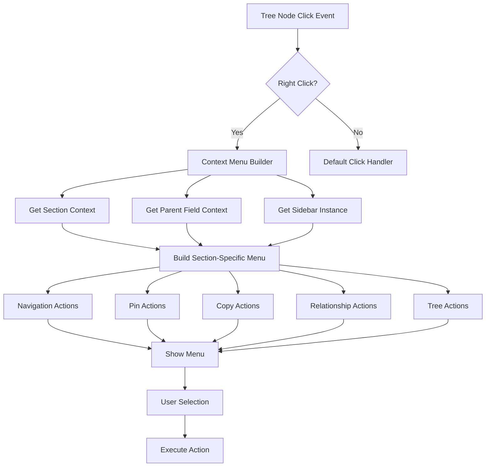

# Milestone 4.3A & 4.3B: Sidebar Context Menu Enhancement

**Status:** Specification Review  
**Priority:** High  
**Estimated Time:** 
- Milestone 4.3A (Core Context Menu): 2-3 days
- Milestone 4.3B (Advanced Context Menu): 2-3 days

---

## Overview

This document outlines the redesigned Milestone 4.3A and 4.3B, which together implement a comprehensive context menu system for the sidebar view. The design accounts for the new multi-parent-field architecture and three-section layout introduced in Milestone 4.2.

---

## Summary of Changes from Original Milestone 4.3

### Original Design
- Single-mode tree view with context menu
- Mode-switching actions ("Show ancestors", "Show descendants")
- Single parent field assumed
- Basic navigation and relationship actions

### New Design
- **Multi-field aware** context menus
- **Section-specific** menu items (Ancestors/Descendants/Siblings)
- **Dynamic field names** in menu items (e.g., "Set as Project parent")
- **Multiple sidebar support** with independent context menus
- **Pin-focused actions** instead of mode switching
- **Split into two milestones** for manageable implementation

---

## Architecture Overview

### Context Menu Integration



### Key Architectural Decisions

1. **Section-Aware Menus**: Context menu adapts based on which section the node appears in
2. **Field-Aware Actions**: Relationship modification actions use currently selected parent field
3. **Multi-Sidebar Support**: Each sidebar instance has independent context menu behavior
4. **Obsidian Menu Integration**: Use Obsidian's native Menu API for consistency
5. **Command Palette Integration**: Expose key actions as assignable commands

---

## Data Structures

### New TypeScript Interfaces

```typescript
/**
 * Context information for building a node context menu
 */
export interface NodeMenuContext {
  /** The tree node that was right-clicked */
  node: TreeNode;
  
  /** The file represented by the node */
  file: TFile;
  
  /** Which section the node appears in */
  section: 'ancestors' | 'descendants' | 'siblings';
  
  /** Currently selected parent field */
  parentField: string;
  
  /** Display name of the parent field */
  parentFieldDisplayName: string;
  
  /** Reference to the sidebar instance */
  sidebarView: RelationSidebarView;
  
  /** Whether the sidebar is currently pinned */
  isPinned: boolean;
  
  /** DOM element that was clicked */
  targetElement: HTMLElement;
}

/**
 * Configuration for a context menu action
 */
export interface MenuAction {
  /** Unique identifier for the action */
  id: string;
  
  /** Display text (can include dynamic placeholders) */
  label: string;
  
  /** Optional icon */
  icon?: string;
  
  /** Whether to show a separator after this item */
  separator?: boolean;
  
  /** Function to execute when selected */
  handler: (context: NodeMenuContext) => void | Promise<void>;
  
  /** Function to determine if action should be shown */
  shouldShow?: (context: NodeMenuContext) => boolean;
  
  /** Function to determine if action should be enabled */
  isEnabled?: (context: NodeMenuContext) => boolean;
  
  /** Keyboard shortcut hint (display only) */
  shortcut?: string;
}

/**
 * Menu action groups for organization
 */
export interface MenuActionGroup {
  /** Group identifier */
  id: string;
  
  /** Actions in this group */
  actions: MenuAction[];
  
  /** Whether to show separator after group */
  separator?: boolean;
}
```

---

## Milestone 4.3A: Core Context Menu

### Goal
Implement essential context menu functionality with navigation, pinning, and copy actions.

### Tasks

#### 1. Context Menu Infrastructure
- [ ] Create `src/context-menu-builder.ts`
- [ ] Implement `ContextMenuBuilder` class
- [ ] Add section detection logic
- [ ] Add field context extraction
- [ ] Integrate with Obsidian's Menu API

#### 2. Navigation Actions
- [ ] Implement "Open in new pane" action
- [ ] Implement "Open to the right" action
- [ ] Implement "Reveal in file explorer" action
- [ ] Add icons for navigation actions
- [ ] Test navigation in various layouts

#### 3. Pin Actions
- [ ] Implement "Pin this note" action
- [ ] Implement "Pin in new sidebar" action
- [ ] Implement "Unpin sidebar" action (contextual)
- [ ] Add visual feedback for pinned state
- [ ] Test multi-sidebar pinning

#### 4. Copy Actions
- [ ] Implement "Copy link" action (wiki-link format)
- [ ] Implement "Copy path to node" action
- [ ] Add clipboard integration
- [ ] Add success notifications
- [ ] Test with various note names

#### 5. Tree Node Integration
- [ ] Add right-click event listeners to tree nodes
- [ ] Prevent default context menu
- [ ] Pass correct context to menu builder
- [ ] Handle keyboard triggers (context menu key)
- [ ] Add hover indicators

#### 6. Basic Styling
- [ ] Style menu items consistently with Obsidian
- [ ] Add icons where appropriate
- [ ] Add separators between action groups
- [ ] Test in light and dark themes

### Acceptance Criteria

- [x] Right-click on any tree node shows context menu
- [x] Menu adapts to section (Ancestors/Descendants/Siblings)
- [x] Navigation actions work correctly
- [x] Pin actions work per sidebar instance
- [x] Copy actions copy correct content to clipboard
- [x] Menu integrates seamlessly with Obsidian UI
- [x] Keyboard context menu key works
- [x] Multiple sidebars work independently

### Deliverables

- `src/context-menu-builder.ts` - Menu building logic
- Updated `src/sidebar-view.ts` - Context menu integration
- Updated `src/tree-renderer.ts` - Right-click handlers
- CSS styles for menu items
- Manual testing checklist

---

## Milestone 4.3B: Advanced Context Menu

### Goal
Implement relationship modification, tree manipulation, and command palette integration.

### Tasks

#### 1. Frontmatter Modification System
- [ ] Create `src/frontmatter-editor.ts`
- [ ] Implement safe frontmatter array modification
- [ ] Add validation for field values
- [ ] Support undo/redo operations
- [ ] Add conflict detection (concurrent edits)

#### 2. Relationship Modification Actions
- [ ] Implement "Set as {Field} parent" action
- [ ] Implement "Remove as {Field} parent" action
- [ ] Implement "Remove as {Field} child" action
- [ ] Add dynamic field name in labels
- [ ] Add confirmation dialogs for destructive actions
- [ ] Show success/error notifications

#### 3. Tree Manipulation Actions
- [ ] Implement "Expand all children" action
- [ ] Implement "Collapse all children" action
- [ ] Implement "Expand to this node" action
- [ ] Add animation for expand/collapse
- [ ] Preserve user's manual expand/collapse state

#### 4. Section-Specific Menu Logic
- [ ] Build section-specific action lists
- [ ] Hide irrelevant actions per section
- [ ] Show contextual actions (e.g., "Remove" only if applicable)
- [ ] Test all section combinations

#### 5. Command Palette Integration
- [ ] Create commands for key context menu actions
- [ ] Add "Pin clicked note" command
- [ ] Add "Set as parent of current note" command
- [ ] Add "Copy link to note" command
- [ ] Allow users to assign keyboard shortcuts
- [ ] Document available commands

#### 6. Advanced Features
- [ ] Add "Copy path to node" with formatting options
- [ ] Add parent field selector for "Set as parent" (multi-field)
- [ ] Add batch operations (multi-select support for future)
- [ ] Add action history/recent actions

### Acceptance Criteria

- [x] Relationship modification works correctly
- [x] Frontmatter is updated safely with undo support
- [x] Dynamic field names shown in menu
- [x] Section-specific actions shown appropriately
- [x] Tree manipulation actions work smoothly
- [x] Commands available in command palette
- [x] Users can assign keyboard shortcuts
- [x] Confirmation dialogs prevent accidental changes
- [x] Error handling is robust

### Deliverables

- `src/frontmatter-editor.ts` - Safe frontmatter modification
- Enhanced `src/context-menu-builder.ts` - Advanced actions
- Updated `src/sidebar-view.ts` - Relationship modification support
- Command registrations in `src/main.ts`
- Comprehensive testing checklist
- User documentation

---

## Context Menu Design

### Ancestors Section Menu

```
📄 Note Name
├─ Pin this note
├─ Pin in new sidebar
├─ ────────────────────────────────
├─ Open in new pane
├─ Open to the right
├─ Reveal in file explorer
├─ ────────────────────────────────
├─ Set as [Project] parent         ← Dynamic field name (4.3B)
├─ Remove as [Project] parent      ← Only if already a parent (4.3B)
├─ ────────────────────────────────
├─ Copy link
├─ Copy path to node
├─ ────────────────────────────────
├─ Expand all children             ← (4.3B)
└─ Collapse all children           ← (4.3B)
```

### Descendants Section Menu

```
📄 Note Name
├─ Pin this note
├─ Pin in new sidebar
├─ ────────────────────────────────
├─ Open in new pane
├─ Open to the right
├─ Reveal in file explorer
├─ ────────────────────────────────
├─ Remove as [Project] child       ← Only in Descendants (4.3B)
├─ ────────────────────────────────
├─ Copy link
├─ Copy path to node
├─ ────────────────────────────────
└─ Expand all children             ← (4.3B)
```

### Siblings Section Menu

```
📄 Note Name
├─ Pin this note
├─ Pin in new sidebar
├─ ────────────────────────────────
├─ Open in new pane
├─ Open to the right
├─ Reveal in file explorer
├─ ────────────────────────────────
├─ Set as [Project] parent         ← Dynamic field name (4.3B)
├─ ────────────────────────────────
├─ Copy link
└─ Copy path to node
```

---

## Implementation Details

### Context Menu Builder

```typescript
/**
 * Builds context menus for tree nodes
 */
export class ContextMenuBuilder {
  private app: App;
  private plugin: ParentRelationPlugin;
  
  constructor(app: App, plugin: ParentRelationPlugin) {
    this.app = app;
    this.plugin = plugin;
  }
  
  /**
   * Builds and shows a context menu for a tree node
   */
  public showContextMenu(
    event: MouseEvent,
    context: NodeMenuContext
  ): void {
    const menu = new Menu();
    
    // Build menu based on milestone and context
    this.addCoreActions(menu, context);      // 4.3A
    this.addAdvancedActions(menu, context);  // 4.3B
    
    // Show menu at click position
    menu.showAtMouseEvent(event);
  }
  
  /**
   * Adds core actions (4.3A)
   */
  private addCoreActions(menu: Menu, context: NodeMenuContext): void {
    // Pin actions
    this.addPinActions(menu, context);
    menu.addSeparator();
    
    // Navigation actions
    this.addNavigationActions(menu, context);
    menu.addSeparator();
    
    // Copy actions
    this.addCopyActions(menu, context);
  }
  
  /**
   * Adds advanced actions (4.3B)
   */
  private addAdvancedActions(menu: Menu, context: NodeMenuContext): void {
    // Relationship modification (section-specific)
    if (this.shouldShowRelationshipActions(context)) {
      menu.addSeparator();
      this.addRelationshipActions(menu, context);
    }
    
    // Tree manipulation
    menu.addSeparator();
    this.addTreeActions(menu, context);
  }
  
  // ... implementation of specific action groups
}
```

### Frontmatter Editor

```typescript
/**
 * Safely modifies note frontmatter
 */
export class FrontmatterEditor {
  private app: App;
  
  constructor(app: App) {
    this.app = app;
  }
  
  /**
   * Adds a value to a frontmatter field array
   */
  async addToField(
    file: TFile,
    fieldName: string,
    value: string
  ): Promise<void> {
    await this.app.fileManager.processFrontMatter(file, (frontmatter) => {
      if (!frontmatter[fieldName]) {
        frontmatter[fieldName] = [];
      }
      
      const fieldArray = Array.isArray(frontmatter[fieldName])
        ? frontmatter[fieldName]
        : [frontmatter[fieldName]];
      
      if (!fieldArray.includes(value)) {
        fieldArray.push(value);
        frontmatter[fieldName] = fieldArray;
      }
    });
  }
  
  /**
   * Removes a value from a frontmatter field array
   */
  async removeFromField(
    file: TFile,
    fieldName: string,
    value: string
  ): Promise<void> {
    await this.app.fileManager.processFrontMatter(file, (frontmatter) => {
      if (!frontmatter[fieldName]) return;
      
      const fieldArray = Array.isArray(frontmatter[fieldName])
        ? frontmatter[fieldName]
        : [frontmatter[fieldName]];
      
      const filtered = fieldArray.filter(v => v !== value);
      
      if (filtered.length === 0) {
        delete frontmatter[fieldName];
      } else if (filtered.length === 1) {
        frontmatter[fieldName] = filtered[0];
      } else {
        frontmatter[fieldName] = filtered;
      }
    });
  }
}
```

---

## Menu Actions Specification

### Core Actions (4.3A)

#### Pin This Note
- **Label**: "Pin this note"
- **Icon**: `pin`
- **Action**: Pin the clicked node to the current sidebar instance
- **Shortcut**: None (assignable via command palette)
- **Show when**: Always
- **Implementation**:
  ```typescript
  context.sidebarView.pinToFile(context.file);
  ```

#### Pin in New Sidebar
- **Label**: "Pin in new sidebar"
- **Icon**: `layout-sidebar-right`
- **Action**: Open a new sidebar instance pinned to this node
- **Shortcut**: None
- **Show when**: Always
- **Implementation**:
  ```typescript
  await this.plugin.openNewSidebarPinnedTo(context.file, context.parentField);
  ```

#### Unpin Sidebar
- **Label**: "Unpin sidebar"
- **Icon**: `pin-off`
- **Action**: Unpin the current sidebar
- **Shortcut**: None
- **Show when**: Only when sidebar is pinned
- **Implementation**:
  ```typescript
  context.sidebarView.unpin();
  ```

#### Open in New Pane
- **Label**: "Open in new pane"
- **Icon**: `file-plus`
- **Action**: Open the note in a new editor pane
- **Shortcut**: None (uses Obsidian default if applicable)
- **Show when**: Always
- **Implementation**:
  ```typescript
  await this.app.workspace.getLeaf('tab').openFile(context.file);
  ```

#### Open to the Right
- **Label**: "Open to the right"
- **Icon**: `separator-vertical`
- **Action**: Open the note in a split pane to the right
- **Shortcut**: None
- **Show when**: Always
- **Implementation**:
  ```typescript
  await this.app.workspace.getLeaf('split', 'vertical').openFile(context.file);
  ```

#### Reveal in File Explorer
- **Label**: "Reveal in file explorer"
- **Icon**: `folder-tree`
- **Action**: Show the note in Obsidian's file explorer
- **Shortcut**: None
- **Show when**: Always
- **Implementation**:
  ```typescript
  this.app.workspace.revealFileInExplorer(context.file);
  ```

#### Copy Link
- **Label**: "Copy link"
- **Icon**: `link`
- **Action**: Copy wiki-link to clipboard
- **Shortcut**: None
- **Show when**: Always
- **Implementation**:
  ```typescript
  await navigator.clipboard.writeText(`[[${context.file.basename}]]`);
  new Notice('Link copied to clipboard');
  ```

#### Copy Path to Node
- **Label**: "Copy path to node"
- **Icon**: `arrow-right-from-line`
- **Action**: Copy hierarchical path from root to this node
- **Shortcut**: None
- **Show when**: Always
- **Implementation**:
  ```typescript
  const path = this.buildPathToNode(context.node);
  await navigator.clipboard.writeText(path);
  new Notice('Path copied to clipboard');
  ```

---

### Advanced Actions (4.3B)

#### Set as {Field} Parent
- **Label**: `Set as ${context.parentFieldDisplayName} parent`
- **Icon**: `arrow-up`
- **Action**: Add this note as a parent in current note's frontmatter
- **Shortcut**: Assignable
- **Show when**: In Ancestors or Siblings sections
- **Implementation**:
  ```typescript
  const currentFile = this.app.workspace.getActiveFile();
  if (currentFile) {
    await this.frontmatterEditor.addToField(
      currentFile,
      context.parentField,
      context.file.basename
    );
    new Notice(`Added as ${context.parentFieldDisplayName} parent`);
  }
  ```

#### Remove as {Field} Parent
- **Label**: `Remove as ${context.parentFieldDisplayName} parent`
- **Icon**: `x`
- **Action**: Remove this note as a parent from current note's frontmatter
- **Shortcut**: None
- **Show when**: In Ancestors section, only if currently a parent
- **Confirm**: "Remove parent relationship?"
- **Implementation**:
  ```typescript
  const currentFile = this.app.workspace.getActiveFile();
  if (currentFile && await this.confirmAction('Remove parent relationship?')) {
    await this.frontmatterEditor.removeFromField(
      currentFile,
      context.parentField,
      context.file.basename
    );
    new Notice(`Removed as ${context.parentFieldDisplayName} parent`);
  }
  ```

#### Remove as {Field} Child
- **Label**: `Remove as ${context.parentFieldDisplayName} child`
- **Icon**: `x`
- **Action**: Remove current note from this note's children
- **Shortcut**: None
- **Show when**: Only in Descendants section
- **Confirm**: "Remove child relationship?"
- **Implementation**:
  ```typescript
  const currentFile = this.app.workspace.getActiveFile();
  if (currentFile && await this.confirmAction('Remove child relationship?')) {
    await this.frontmatterEditor.removeFromField(
      context.file,
      context.parentField,
      currentFile.basename
    );
    new Notice(`Removed as ${context.parentFieldDisplayName} child`);
  }
  ```

#### Expand All Children
- **Label**: "Expand all children"
- **Icon**: `chevrons-down`
- **Action**: Recursively expand all descendants of this node
- **Shortcut**: None
- **Show when**: Node has children
- **Implementation**:
  ```typescript
  this.treeRenderer.expandAllChildren(context.node);
  ```

#### Collapse All Children
- **Label**: "Collapse all children"
- **Icon**: `chevrons-up`
- **Action**: Recursively collapse all descendants of this node
- **Shortcut**: None
- **Show when**: Node has children
- **Implementation**:
  ```typescript
  this.treeRenderer.collapseAllChildren(context.node);
  ```

#### Expand to This Node
- **Label**: "Expand to this node"
- **Icon**: `arrow-down-to-line`
- **Action**: Expand all ancestors to make this node visible
- **Shortcut**: None
- **Show when**: Node is not at root level
- **Implementation**:
  ```typescript
  this.treeRenderer.expandToNode(context.node);
  ```

---

## Implementation Sequence

### Phase 1: Milestone 4.3A (Core Context Menu)

**Week 1, Day 1-2: Infrastructure**
- Create `ContextMenuBuilder` class
- Add right-click event handling to tree nodes
- Implement section and field context detection
- Test basic menu display

**Week 1, Day 3: Navigation Actions**
- Implement "Open in new pane"
- Implement "Open to the right"
- Implement "Reveal in file explorer"
- Test all navigation actions

**Week 2, Day 1: Pin Actions**
- Implement "Pin this note"
- Implement "Pin in new sidebar"
- Implement "Unpin sidebar" (conditional)
- Test multi-sidebar pinning

**Week 2, Day 2: Copy Actions**
- Implement "Copy link"
- Implement "Copy path to node"
- Add clipboard integration and notifications
- Test with various note names and paths

**Week 2, Day 3: Polish & Testing**
- Add icons and styling
- Test in light and dark themes
- Test keyboard context menu key
- Manual testing checklist completion

---

### Phase 2: Milestone 4.3B (Advanced Context Menu)

**Week 3, Day 1-2: Frontmatter System**
- Create `FrontmatterEditor` class
- Implement safe field modification
- Add validation and error handling
- Test with various frontmatter structures

**Week 3, Day 3: Relationship Actions**
- Implement "Set as {Field} parent"
- Implement "Remove as {Field} parent"
- Implement "Remove as {Field} child"
- Add dynamic field name display
- Add confirmation dialogs

**Week 4, Day 1: Tree Manipulation**
- Implement "Expand all children"
- Implement "Collapse all children"
- Implement "Expand to this node"
- Add animations and state persistence

**Week 4, Day 2: Section-Specific Logic**
- Build section-specific action filters
- Test all section combinations
- Add contextual action visibility
- Validate menu structure

**Week 4, Day 3: Command Integration & Polish**
- Register commands in command palette
- Add keyboard shortcut support
- Comprehensive testing
- Documentation updates

---

## Testing Strategy

### Manual Testing Checklist (Milestone 4.3A)

- [ ] **Right-Click Handling**
  - [ ] Right-click shows context menu
  - [ ] Context menu shows at correct position
  - [ ] Menu closes when clicking elsewhere
  - [ ] Keyboard context menu key works
  
- [ ] **Navigation Actions**
  - [ ] "Open in new pane" works
  - [ ] "Open to the right" creates split pane
  - [ ] "Reveal in file explorer" shows file
  - [ ] Actions work from all sections
  
- [ ] **Pin Actions**
  - [ ] "Pin this note" pins correctly
  - [ ] "Pin in new sidebar" creates new instance
  - [ ] "Unpin sidebar" shows when pinned
  - [ ] Multiple sidebars work independently
  
- [ ] **Copy Actions**
  - [ ] "Copy link" copies wiki-link
  - [ ] "Copy path to node" copies hierarchy
  - [ ] Notifications show on copy
  - [ ] Works with special characters in names
  
- [ ] **Visual Integration**
  - [ ] Menu matches Obsidian theme
  - [ ] Icons display correctly
  - [ ] Separators show appropriately
  - [ ] Works in light and dark themes

---

### Manual Testing Checklist (Milestone 4.3B)

- [ ] **Relationship Modification**
  - [ ] "Set as parent" adds to frontmatter
  - [ ] "Remove as parent" removes from frontmatter
  - [ ] "Remove as child" works correctly
  - [ ] Dynamic field names display
  - [ ] Confirmation dialogs appear
  - [ ] Undo/redo works
  
- [ ] **Section-Specific Menus**
  - [ ] Ancestors section shows correct actions
  - [ ] Descendants section shows "Remove child"
  - [ ] Siblings section shows appropriate actions
  - [ ] Actions hide when not applicable
  
- [ ] **Tree Manipulation**
  - [ ] "Expand all children" works recursively
  - [ ] "Collapse all children" works correctly
  - [ ] "Expand to this node" reveals path
  - [ ] State persists during session
  
- [ ] **Command Palette**
  - [ ] Commands appear in palette
  - [ ] Keyboard shortcuts assignable
  - [ ] Commands work without menu
  
- [ ] **Error Handling**
  - [ ] Invalid operations show errors
  - [ ] Frontmatter conflicts handled
  - [ ] Network/file errors handled gracefully

---

## Breaking Changes & Migration

### No Breaking Changes Expected

This milestone adds new functionality without changing existing APIs or data structures. Key points:

1. **Additive only**: New context menu system doesn't modify existing behavior
2. **Optional features**: All relationship modification is user-initiated
3. **Backward compatible**: Works with both milestone 4.2A and 4.2B features
4. **Safe frontmatter editing**: Uses Obsidian's built-in processFrontMatter API

---

## Performance Considerations

### Context Menu Display
- **Target**: Menu appears in <50ms after right-click
- **Strategy**: Pre-build action registry, lazy-evaluate visibility conditions

### Frontmatter Modification
- **Target**: Frontmatter update completes in <200ms
- **Strategy**: Use Obsidian's optimized processFrontMatter API, minimal validation

### Multiple Sidebars
- **Target**: Support up to 5 simultaneous sidebar instances
- **Strategy**: Independent event handling per instance, shared graph data

---

## Success Metrics

### Milestone 4.3A
- ✅ Context menu appears on right-click
- ✅ All core actions functional
- ✅ Works across all three sections
- ✅ Multi-sidebar support verified
- ✅ UI matches Obsidian standards
- ✅ No performance degradation

### Milestone 4.3B
- ✅ Relationship modification works correctly
- ✅ Frontmatter updated safely
- ✅ Section-specific actions show appropriately
- ✅ Tree manipulation smooth and intuitive
- ✅ Command palette integration complete
- ✅ Error handling robust
- ✅ User documentation comprehensive

---

## Documentation Updates Required

1. **README.md**: Add context menu features section
2. **User Guide**: Document all context menu actions with screenshots
3. **API Reference**: Document `ContextMenuBuilder` and `FrontmatterEditor` APIs
4. **Keyboard Shortcuts Guide**: List assignable commands
5. **Troubleshooting**: Common issues with relationship modification

---

## Future Enhancements (Post 4.3)

Ideas to consider for later milestones:

1. **Multi-select support**: Batch operations on multiple nodes
2. **Custom menu actions**: Allow other plugins to add actions
3. **Drag-and-drop**: Drag nodes to modify relationships
4. **Quick actions bar**: Floating toolbar for common actions
5. **Action history**: Recently used context menu actions
6. **Keyboard navigation**: Arrow keys to navigate menu
7. **Context menu presets**: User-configurable action sets

---

## Questions for User Review

1. ✅ Does this specification align with your vision for the context menu?
2. ✅ Are the section-specific menus intuitive?
3. ✅ Is the split between 4.3A and 4.3B reasonable?
4. ✅ Are there any additional context menu actions needed?
5. ✅ Should we add more keyboard shortcuts by default?
6. ✅ Any concerns about frontmatter modification safety?

---

**Document Version:** 1.0  
**Last Updated:** 2025-11-15  
**Status:** Ready for Review

Please review this specification and provide feedback. Once approved, I'll proceed with implementation or create further detailed task breakdowns as needed.